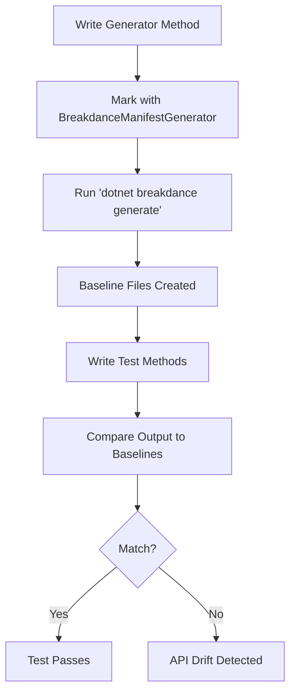

# Baseline Testing with Breakdance

## Overview

Breakdance provides a powerful baseline testing system that helps you detect and manage API drift, ensuring your public API surface remains stable and changes are intentional. This documentation explains how to create and maintain baseline tests that capture your API's current state and alert you when unexpected changes occur.



## Key Concepts

### What is Baseline Testing?

Baseline testing captures the current state of your API or output as a "baseline" file, then continuously verifies that future changes match this baseline. This approach is particularly useful for:

- **API Surface Monitoring**: Detect unintended breaking changes in your public API
- **Dependency Injection Verification**: Track changes in service registrations
- **Configuration Validation**: Ensure configuration outputs remain consistent
- **Serialization Contracts**: Verify that serialized outputs don't change unexpectedly

### Benefits

<Card title="Detect Breaking Changes" icon="shield-exclamation">
  Automatically catch API changes that could break consumers
</Card>

<Card title="Document Evolution" icon="clock">
  Baseline files serve as historical documentation of your API
</Card>

<Card title="Intentional Changes" icon="check">
  Force developers to explicitly regenerate baselines for intentional changes
</Card>

## Setting Up Baseline Testing

### Step 1: Configure Your Test Project

Add the Breakdance assembly attribute to your test project's `.csproj` file:

```xml
<Project Sdk="Microsoft.NET.Sdk">
  <ItemGroup>
    <AssemblyAttribute Include="CloudNimble.Breakdance.Assemblies.BreakdanceTestAssembly" />
  </ItemGroup>
</Project>
```

### Step 2: Install Required Packages

```xml
<ItemGroup>
  <PackageReference Include="CloudNimble.Breakdance.Assemblies" Version="*" />
  <PackageReference Include="FluentAssertions" Version="*" />
  <PackageReference Include="Microsoft.VisualStudio.TestTools.UnitTesting" Version="*" />
</ItemGroup>
```

### Step 3: Create a Baselines Folder

Create a `Baselines` folder in your test project to store baseline files:

```
YourProject.Tests/
├── Baselines/
│   ├── PublicApi.txt
│   ├── ServiceCollection.txt
│   └── Configuration.json
├── ApiTests.cs
└── YourProject.Tests.csproj
```

## Writing Baseline Generators

### Basic Generator Method

Generator methods create the baseline files. They must be marked with the `[BreakdanceManifestGenerator]` attribute:

```csharp
using CloudNimble.Breakdance.Assemblies;
using System.IO;

public class ApiBaselineTests
{
    [BreakdanceManifestGenerator]
    public void GeneratePublicApiBaseline(string projectPath)
    {
        // Generate your API surface report
        var report = PublicApiHelpers.GetPublicApiSurfaceReport("YourAssembly.dll");
        
        // Write to the Baselines folder
        var baselinePath = Path.Combine(projectPath, "Baselines", "PublicApi.txt");
        
        // Ensure directory exists
        Directory.CreateDirectory(Path.GetDirectoryName(baselinePath));
        
        // Write the baseline
        File.WriteAllText(baselinePath, report);
    }
}
```

<Warning>
  Generator methods are NOT test methods. They don't run during normal test execution.
</Warning>

### Generator Method Patterns

#### Pattern 1: Simple String Output

```csharp
[BreakdanceManifestGenerator]
public void GenerateConfigurationBaseline(string projectPath)
{
    var config = BuildConfiguration();
    var output = config.ToString();
    
    var path = Path.Combine(projectPath, "Baselines", "Configuration.txt");
    File.WriteAllText(path, output);
}
```

#### Pattern 2: JSON Serialization

```csharp
[BreakdanceManifestGenerator]
public void GenerateJsonBaseline(string projectPath)
{
    var data = GetComplexDataStructure();
    var json = JsonSerializer.Serialize(data, new JsonSerializerOptions 
    { 
        WriteIndented = true,
        PropertyNameCaseInsensitive = true
    });
    
    var path = Path.Combine(projectPath, "Baselines", "DataStructure.json");
    File.WriteAllText(path, json);
}
```

#### Pattern 3: Multi-Target Baselines

```csharp
[BreakdanceManifestGenerator]
public void GenerateFrameworkSpecificBaseline(string projectPath)
{
    var output = GenerateOutput();
    
#if NET8_0_OR_GREATER
    var filename = "Baseline_NET8.txt";
#elif NET6_0_OR_GREATER
    var filename = "Baseline_NET6.txt";
#else
    var filename = "Baseline_NETFX.txt";
#endif
    
    var path = Path.Combine(projectPath, "Baselines", filename);
    File.WriteAllText(path, output);
}
```

## Writing Baseline Tests

Once you have baseline files, write tests that compare current output against them:

### Basic Baseline Test

```csharp
[TestClass]
public class ApiTests
{
    private const string ProjectPath = "..//..//..//";
    
    [TestMethod]
    public void PublicApi_ShouldMatchBaseline()
    {
        // Generate current output
        var currentApi = PublicApiHelpers.GetPublicApiSurfaceReport("YourAssembly.dll");
        
        // Read baseline
        var baselinePath = Path.Combine(ProjectPath, "Baselines", "PublicApi.txt");
        var baseline = File.ReadAllText(baselinePath);
        
        // Compare
        currentApi.Should().Be(baseline, 
            "Public API has changed. If this is intentional, regenerate baselines using 'dotnet breakdance generate'");
    }
}
```

### Advanced Patterns

#### Pattern 1: Service Collection Verification

```csharp
[TestMethod]
public void ServiceCollection_ShouldMatchBaseline()
{
    var services = new ServiceCollection();
    ConfigureServices(services);
    
    var output = services.GetContainerContentsLog();
    var baseline = File.ReadAllText(Path.Combine(ProjectPath, "Baselines", "Services.txt"));
    
    output.Should().Be(baseline);
}
```

#### Pattern 2: Configuration Validation

```csharp
[TestMethod]
public void Configuration_ShouldMatchBaseline()
{
    var config = new ConfigurationBuilder()
        .AddJsonFile("appsettings.json")
        .Build();
    
    var output = config.GetDebugView();
    var baseline = File.ReadAllText(Path.Combine(ProjectPath, "Baselines", "Config.txt"));
    
    output.Should().Be(baseline);
}
```

#### Pattern 3: Multi-Target Testing

```csharp
[TestMethod]
public void FrameworkSpecific_ShouldMatchBaseline()
{
    var output = GenerateOutput();
    
#if NET8_0_OR_GREATER
    var baselineFile = "Baseline_NET8.txt";
#elif NET6_0_OR_GREATER
    var baselineFile = "Baseline_NET6.txt";
#else
    var baselineFile = "Baseline_NETFX.txt";
#endif
    
    var baseline = File.ReadAllText(Path.Combine(ProjectPath, "Baselines", baselineFile));
    output.Should().Be(baseline);
}
```

## Using the Breakdance CLI

### Installation

Install the Breakdance CLI tool globally:

```bash
dotnet tool install -g CloudNimble.Breakdance.Tools
```

### Generating Baselines

Run the generator methods to create or update baseline files:

```bash
# Generate baselines for all test projects in current directory
dotnet breakdance generate

# Specify a path
dotnet breakdance generate -path C:\MyProject

# Target specific configuration
dotnet breakdance generate -config Release

# Target specific project
dotnet breakdance generate -project MyProject.Tests
```

<Note>
  The CLI tool will only invoke methods marked with `[BreakdanceManifestGenerator]` in assemblies marked with `[BreakdanceTestAssembly]`.
</Note>

### Command Options

| Option | Description | Default |
|--------|-------------|---------|
| `-path <path>` | Working directory for the code compiler | Current directory |
| `-config <configuration>` | Build configuration (Debug/Release) | Debug |
| `-project <project>` | Single project to analyze | All test projects |

## Best Practices

### 1. Deterministic Output

Ensure your baseline generators produce deterministic output:

```csharp
[BreakdanceManifestGenerator]
public void GenerateDeterministicBaseline(string projectPath)
{
    var data = GetData()
        .OrderBy(x => x.Name)  // Sort for consistency
        .Select(x => new 
        {
            x.Name,
            x.Type,
            // Exclude non-deterministic fields like timestamps
        });
    
    var json = JsonSerializer.Serialize(data, new JsonSerializerOptions
    {
        WriteIndented = true,
        PropertyNamingPolicy = JsonNamingPolicy.CamelCase,
        Converters = { new JsonStringEnumConverter() }
    });
    
    File.WriteAllText(Path.Combine(projectPath, "Baselines", "Data.json"), json);
}
```

### 2. Version Control

<Tabs>
  <Tab title="DO">
    - Check baseline files into version control
    - Review baseline changes in pull requests
    - Document why baselines changed in commit messages
    - Use `.gitattributes` to handle line endings consistently
  </Tab>
  <Tab title="DON'T">
    - Ignore baseline files in `.gitignore`
    - Auto-generate baselines in CI/CD
    - Mix generated and hand-edited content in baselines
    - Include timestamps or other non-deterministic data
  </Tab>
</Tabs>

### 3. Handling Intentional Changes

When you intentionally change your API:

1. Make your code changes
2. Run `dotnet breakdance generate` to update baselines
3. Review the baseline diff to ensure only expected changes
4. Commit both code and baseline changes together
5. Document the breaking change in your release notes

### 4. Organizing Baselines

Structure your baselines folder logically:

```
Baselines/
├── Api/
│   ├── PublicApi.txt
│   └── InternalApi.txt
├── Config/
│   ├── Development.json
│   └── Production.json
└── Services/
    ├── NET6/
    │   └── ServiceCollection.txt
    └── NET8/
        └── ServiceCollection.txt
```

### 5. Error Messages

Provide clear error messages when baselines don't match:

```csharp
[TestMethod]
public void Api_ShouldMatchBaseline()
{
    var current = GetCurrentApi();
    var baseline = File.ReadAllText(baselinePath);
    
    current.Should().Be(baseline, because: 
        "API surface has changed. This may break existing consumers.\n" +
        "If this change is intentional:\n" +
        "1. Run 'dotnet breakdance generate' to update baselines\n" +
        "2. Review the changes carefully\n" +
        "3. Update version number if this is a breaking change\n" +
        "4. Document the change in CHANGELOG.md");
}
```

## Common Scenarios

### Detecting Breaking API Changes

```csharp
public class ApiSurfaceTests
{
    [BreakdanceManifestGenerator]
    public void GenerateApiSurface(string projectPath)
    {
        var assembly = Assembly.LoadFrom("MyLibrary.dll");
        var types = assembly.GetExportedTypes()
            .OrderBy(t => t.FullName)
            .Select(t => new
            {
                Type = t.FullName,
                Members = t.GetMembers(BindingFlags.Public | BindingFlags.Instance | BindingFlags.Static)
                    .OrderBy(m => m.Name)
                    .Select(m => $"{m.MemberType}: {m}") 
            });
        
        var report = string.Join("\n", types.SelectMany(t => 
            new[] { $"Type: {t.Type}" }.Concat(t.Members.Select(m => $"  {m}"))));
        
        File.WriteAllText(Path.Combine(projectPath, "Baselines", "ApiSurface.txt"), report);
    }
    
    [TestMethod]
    public void ApiSurface_ShouldNotHaveBreakingChanges()
    {
        // Test implementation comparing against baseline
    }
}
```

### Tracking Dependency Injection Registrations

```csharp
public class ServiceRegistrationTests
{
    [BreakdanceManifestGenerator]
    public void GenerateServiceRegistrations(string projectPath)
    {
        var services = new ServiceCollection();
        var startup = new Startup();
        startup.ConfigureServices(services);
        
        var report = services.GetContainerContentsLog();
        File.WriteAllText(Path.Combine(projectPath, "Baselines", "Services.txt"), report);
    }
    
    [TestMethod]
    public void Services_ShouldMatchExpectedRegistrations()
    {
        // Verify services match baseline
    }
}
```

### Validating Serialization Contracts

```csharp
public class SerializationTests
{
    [BreakdanceManifestGenerator]
    public void GenerateSerializationContract(string projectPath)
    {
        var sample = new CustomerDto
        {
            Id = 1,
            Name = "Sample",
            CreatedDate = new DateTime(2024, 1, 1),
            Orders = new[] { new OrderDto { Id = 1, Amount = 100.00m } }
        };
        
        var json = JsonSerializer.Serialize(sample, new JsonSerializerOptions 
        { 
            WriteIndented = true 
        });
        
        File.WriteAllText(Path.Combine(projectPath, "Baselines", "CustomerContract.json"), json);
    }
}
```

## Troubleshooting

### Common Issues and Solutions

<AccordionGroup>
  <Accordion title="Generator methods not found">
    **Symptom**: "No suitable methods were found" error
    
    **Solutions**:
    - Ensure methods have `[BreakdanceManifestGenerator]` attribute
    - Verify assembly has `[BreakdanceTestAssembly]` attribute
    - Check method is public
    - Rebuild project before running generator
  </Accordion>
  
  <Accordion title="Baseline files not created">
    **Symptom**: Files aren't written to disk
    
    **Solutions**:
    - Check the `projectPath` parameter value
    - Ensure directory creation before writing file
    - Verify write permissions
    - Check for exceptions in generator method
  </Accordion>
  
  <Accordion title="Inconsistent baselines">
    **Symptom**: Baselines change without code changes
    
    **Solutions**:
    - Remove timestamps and GUIDs from output
    - Sort collections before serializing
    - Use consistent culture settings
    - Normalize line endings
  </Accordion>
  
  <Accordion title="Tests can't find baseline files">
    **Symptom**: FileNotFoundException in tests
    
    **Solutions**:
    - Use correct relative path (typically `"..//..//..//"`)
    - Ensure baselines are included in source control
    - Check file exists after running generator
    - Verify working directory in test execution
  </Accordion>
</AccordionGroup>

## Migration Guide

### Migrating from Manual Baseline Management

If you're currently maintaining baselines manually:

1. **Create generator methods** for each baseline type
2. **Run generators** to create initial baselines
3. **Compare** generated baselines with manual ones
4. **Update tests** to use the generated baselines
5. **Remove** manual baseline creation code

### Migrating from Approval Tests

If you're using approval testing frameworks:

```csharp
// Before: Using approval tests
[TestMethod]
public void TestWithApprovals()
{
    var output = GenerateOutput();
    Approvals.Verify(output);
}

// After: Using Breakdance baselines
[BreakdanceManifestGenerator]
public void GenerateOutputBaseline(string projectPath)
{
    var output = GenerateOutput();
    File.WriteAllText(Path.Combine(projectPath, "Baselines", "Output.txt"), output);
}

[TestMethod]
public void TestWithBaseline()
{
    var output = GenerateOutput();
    var baseline = File.ReadAllText("Baselines/Output.txt");
    output.Should().Be(baseline);
}
```

## Summary

Baseline testing with Breakdance provides a robust solution for detecting API drift and managing intentional changes. By separating baseline generation from testing, and providing clear tooling support, Breakdance makes it easy to:

- Track API evolution over time
- Detect breaking changes early
- Document intentional changes
- Maintain stable contracts

Remember: **Baselines are your API contract**. Treat changes to baselines with the same care as changes to your public API.

<Card title="Next Steps" icon="rocket">
  1. Add `[BreakdanceTestAssembly]` to your test project
  2. Create your first generator method
  3. Run `dotnet breakdance generate`
  4. Write tests that verify against baselines
  5. Commit baselines to source control
</Card>