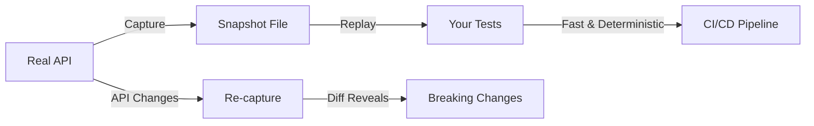

## The Mocking Trap

Every .NET developer knows the pattern: create an interface, inject dependencies, mock everything in tests.
It sounds clean. It feels testable. But it creates a fundamental problem:

**Your tests pass in a universe that doesn't exist.**

Mocks are imagination codified. They represent what you *think* an API returns, how you *assume* an error
manifests, what you *hope* the edge cases look like. When your imagination doesn't match reality,
your tests become lies that pass with green checkmarks.

## The Real Cost of Mocks

<AccordionGroup>
  <Accordion title="Maintenance Burden" icon="wrench">
    Every API change requires updating mock configurations across your test suite. Miss one spot,
    and your tests still pass while your production code fails. The larger your codebase, the more
    mock maintenance becomes a full-time job.
  </Accordion>

  <Accordion title="False Confidence" icon="shield-xmark">
    Green tests feel good. They signal "everything works." But mock-based tests only prove your code
    works with your mocks. They say nothing about whether your code works with real services,
    real data, or real edge cases.
  </Accordion>

  <Accordion title="Missing Edge Cases" icon="bug">
    Real APIs return unexpected data. Null values where you expected objects. Arrays when you expected
    singles. Error messages in formats you didn't anticipate. Mocks can't capture what you don't know
    to mock.
  </Accordion>

  <Accordion title="Drift from Reality" icon="arrow-trend-down">
    APIs evolve. External services add fields, deprecate endpoints, change error formats. Your mocks
    stay frozen in time, creating an ever-widening gap between what tests verify and what production
    encounters.
  </Accordion>
</AccordionGroup>

## A Different Philosophy

Breakdance is built on a simple belief: **tests should exercise real behavior, not imagined behavior.**

Instead of writing mock configurations that describe what you think will happen, Breakdance helps you
capture what actually happens and replay it in your tests.

<CardGroup cols={2}>
  <Card title="Capture Once" icon="camera">
    Record real HTTP responses, real API behaviors, real edge cases from actual systems.
    Store them as snapshot files alongside your tests.
  </Card>
  <Card title="Replay Forever" icon="rotate">
    Your tests read from these snapshots instantly - no network calls, no rate limits,
    no flaky dependencies. Fast, deterministic, and offline-capable.
  </Card>
</CardGroup>

## What "Test Real Things" Means

<Steps>
  <Step title="Real Responses">
    When you test HTTP client code, use actual responses captured from real APIs.
    Your code parses the same JSON, handles the same edge cases, and encounters
    the same quirks as production.
  </Step>
  <Step title="Real Infrastructure">
    When you test Azure Storage code, use Azurite - a real Azure Storage emulator
    that behaves identically to the cloud service. Not a mock, not a stub - the
    actual storage API.
  </Step>
  <Step title="Real Pipelines">
    When you test ASP.NET APIs, use TestServer to run your actual middleware,
    routing, and controller logic in-memory. Same code, same DI container,
    same behavior.
  </Step>
  <Step title="Real Formats">
    When you define test requests, use the `.http` file format - the same format
    Visual Studio and VS Code use. Human-readable, portable, and immediately
    executable.
  </Step>
</Steps>

## The Snapshot Workflow

The Breakdance workflow replaces mock maintenance with snapshot management:

1. **Capture**: Run your code against real APIs once. Breakdance saves responses to files.
2. **Commit**: Check snapshot files into source control with your tests.
3. **Replay**: Tests read from files instantly. No network, no secrets needed.
4. **Refresh**: When APIs change, re-capture. Git diff shows exactly what changed.

## When to Use What

| Scenario | Breakdance Approach |
|----------|---------------------|
| Testing HTTP client code | Response Snapshots - capture and replay real API responses |
| Testing your own APIs | In-memory TestServer - run your actual ASP.NET pipeline |
| Testing Azure Storage | Azurite integration - real storage API, local execution |
| Documenting API contracts | Request Snapshots - `.http` files that serve as tests and docs |
| CI/CD without secrets | All approaches - snapshots eliminate external dependencies |

## What Breakdance Doesn't Do

Breakdance isn't against all forms of test isolation. There are legitimate cases for:

- **Seams for DI**: Constructor injection for swapping implementations
- **In-memory databases**: EF Core's in-memory provider for data tests
- **Test fixtures**: Setup and teardown for stateful resources

What Breakdance eliminates is **behavioral mocking** - the practice of writing code that pretends
to be something else. Instead of `mockHttp.Setup(x => x.GetAsync(...)).Returns(...)`,
you capture what `GetAsync` actually returns.

## The Result

Teams using Breakdance report:

<CardGroup cols={3}>
  <Card title="Faster Tests" icon="bolt">
    Snapshot replay is instant. No network latency, no external service slowdowns.
  </Card>
  <Card title="Fewer Surprises" icon="face-smile">
    Production issues that mocks would have hidden surface during development.
  </Card>
  <Card title="Less Maintenance" icon="clock">
    Refreshing snapshots is faster than updating mock configurations.
  </Card>
</CardGroup>

## Ready to Break Free?

Start with the concept that fits your current testing pain:

<CardGroup cols={2}>
  <Card title="I call external APIs" icon="globe" href="/guides/web/snapshots/responses">
    Learn how Response Snapshots capture and replay real HTTP responses.
  </Card>
  <Card title="I build ASP.NET APIs" icon="server" href="/guides/web/aspnet-core-rest">
    Test your controllers with in-memory TestServer - no deployment needed.
  </Card>
  <Card title="I use Azure Storage" icon="cloud" href="/guides/testing-azure-storage">
    Test against real Azurite instead of mocking storage operations.
  </Card>
  <Card title="I want the full picture" icon="book" href="/guides/web/snapshots/index">
    Understand the complete "Test Real Things" philosophy and workflow.
  </Card>
</CardGroup>
